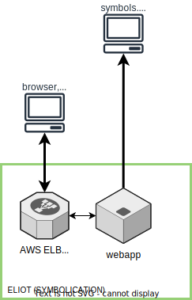

========
Overview
========

.. contents::
   :local:

What is Eliot?
==============

Eliot is the Mozilla Symbolication Server which has a symbolication API for
converting memory addresses into symbols (:ref:`symbolication
<symbolication>`).

The webapp uses the `Symbolic library <https://github.com/getsentry/symbolic>`_
to parse SYM files and do symbol lookups.

The webapp runs in a Docker container and is composed of:

* `Honcho <https://honcho.readthedocs.io/>`_ process which manages:

  * ``eliot_web``: `gunicorn <https://docs.gunicorn.org/en/stable//>`_ which
    runs multiple worker webapp processes
  * ``eliot_disk_manager``: a disk cache manager process

The webapp handles HTTP requests by pulling sym files from the urls configured
by ``ELIOT_SYMBOL_URLS``. By default, that's
``https://symbols.mozilla.org/try``.

The webapp downloads sym files, parses them into symcache files, and performs
symbol lookups with the symcache files. Parsing sym files and generating
symcache files takes a long time, so it stores the symcache files in a disk
cache shared by all webapp processes running in that Docker container. The disk
cache manager process deletes least recently used items from the disk cache to
keep it under ``ELIOT_SYMBOLS_CACHE_MAX_SIZE`` bytes.

Architecture
============

Rough architecture diagram of Eliot:

Repository structure
====================

Here's a bunch of top-level directories and what's in them:

.. code-block:: text

   bin/               -- scripts for running and developing
   docker/            -- Dockerfile and image building bits
   docs/              -- documentation
   schemas/           -- API schemas
   eliot/             -- Symbolication service unit tests and code (Eliot)

.. Note::

   Originally, there was just Tecken which handled upload, download, and
   symbolication. Then we split symbolication into a separate service
   codenamed Eliot [#eliotname]_, but it was in the tecken repository. Then
   we split it out as a completely separate project.

   .. [#eliotname] Tecken Symoblication -> TS Eliot.
